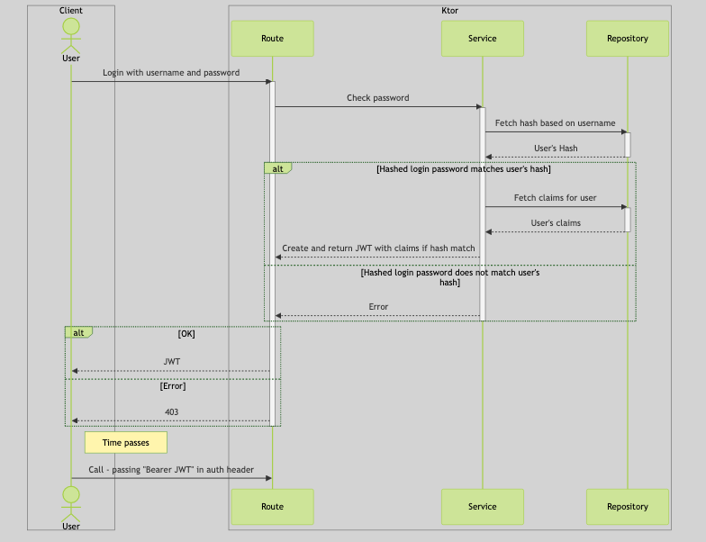

slide-transition: true
slidenumbers: true


---

# [fit] Ktor

---

## What? / Why?

- Async server/client framework
- Lightweight
- Flexible

<br>

- Based on kotlin with full coroutine support
- Kotlin - using both DSL and extension support
- Full tooling support and java interop

---

## App starter

[https://start.ktor.io/](https://start.ktor.io/)

- Give the project a name
- Under adjust project settings - choose your preferred build system
  - I will be using Gradle Kotlin
- Choose
  - latest stable ktor version
  - CIO as engine
  - Config in HOCON file
  - Uncheck sample code

---

### Plugins

Choose to add some plugins - let's start with something basic

- Routing
- Static Content
- Status Pages
- Content Negotiation
- Kotlinx Serialization
- Generate, download, unpack and open

---

## Let's have a look at what we got

Open the project in Idea.

If using gradle and a late JDK - you might need to update the gradle wrapper:

```shell
./gradlew wrapper --gradle-version 8.12.1
```

(use the latest version)

Tidy each of the plugin files (remove any empty routing blocks).

Check if it runs OK (run Application).

---

## Let's get static pages working

Add a new file under plugins for static pages

Add the following code:

```kotlin
fun Application.configureStaticPages() {
    routing {
        staticFiles("/static", File("content"))
    }
}
```

and add a content directory under the project root - with a simple index.html page inside

Finally - add the plugin to application (call `configureStaticPages`)

---

## Static pages from the built jar?

We can also add static resources that will load from the classpath

Expand the routing block

```kotlin
staticResources("/staticresource", "staticcontent")
```

Add a directory staticcontent under src/main/resources - and add a simple index.html file there too

---

## Documentation

[https://ktor.io/docs/serving-static-content.html](https://ktor.io/docs/serving-static-content.html)

---

## Routing

We've already used routing for the static pages - what else can we do?

Let's create a simple get request.

---

### Get

Add a new plugin file and create the following:

```kotlin
fun Application.configureSimpleRequests() {
    routing {
        get("/get_1") {
            call.respondText("Get 1")
        }
    }
}
```

Add it to the list of plugins the application loads

---

### Routing blocks

- `route('path') {}`
  - groups calls under a given path - can be nested
- `get {}` or `get('path') {}`
  - creates a get endpoint
- similar for post, put, patch, delete etc

---

### Dynamic

OK - but this isn't much better than static files - how can we accept

- path parameters?
- query parameters?
- post request bodies?
- ...

---

### Parameters

Add a couple of routes to the simple request routing block:

```kotlin
get("/pathParam/{paramName}") {
    call.respondText(call.parameters["paramName"] ?: "No paramName supplied")
}

get("/queryParam") {
    call.respondText(call.request.queryParameters["paramName"] ?: "No paramName supplied")
}
```

Note that we are forced to handle the fact that the params may not be supplied (they return String?)

This is the case for both even though the pathParam route will not match without a param.

---

## Documentation

[https://ktor.io/docs/routing-in-ktor.html](https://ktor.io/docs/routing-in-ktor.html)
[https://ktor.io/docs/requests.html](https://ktor.io/docs/requests.html)

---

## But plain text is boring

Let's consume a request body to a data class - and echo it back

---

### Data class

We'll need a class - for now - just throw it into the same file as the simple request routes.

kotlinx.serialization needs the `@Serializable` annotation.

```kotlin
@Serializable
data class SimpleRequestBody(val name: String, val message: String)
```

---

### Routes

Add this to the routing block:

```kotlin
route("/simpleBody") {
    get {
        call.respond(SimpleRequestBody("Hi", "There"))
    }
    post {
        val body = call.receive<SimpleRequestBody>()
        call.respond(body)
    }
}
```

---

## Documentation

[https://ktor.io/docs/serialization.html](https://ktor.io/docs/serialization.html)

---

## Logging

Ktor by default provides an slf4j compatible logging using logback classic as the implementation.

Let's add the following:

- call logging
- call ID
- custom loggers for our code

---

### Call Logging

New dependency:

`io.ktor:ktor-server-call-logging`

Add a new module plugin for logging

```kotlin
fun Application.configureLogging() {
    install(CallLogging)
}
```

Remember to call it from your application.

---

### Call ID

For larger systems - we may want a unique ID for a call that is used for calls on to other backends. A correlation ID.

New dependency:

`io.ktor:ktor-server-call-id`

Add this to the logging plugin config

```kotlin
install(CallId) {
    generate {
        UUID.randomUUID().toString()
    }
}
```

Remember to call it from your application.

---

### Call ID in MDC?

So - we can see the ID is being set in the logs:

`Setting id for a call ... to 72748957-0bbf-4f4d-8262-8abe5d2bce1c`

But - we want to see it for all logs related.

We can add it to the MDC.

Add this to the configuration of the **CallLogging** block

```
callIdMdc("call-id")
```

---

### Still nothing in the logs?

Logback classic needs the MDC configuration in its encoder pattern.

Edit the pattern in logback.xml - either add %X (whole MDC) or %X{call-id}

---

## Documentation

[https://ktor.io/docs/call-logging.html](https://ktor.io/docs/call-logging.html)
[https://ktor.io/docs/call-id.html](https://ktor.io/docs/call-id.html)

---

### Code logging

Full support for just using the slf4j API is already present - but I prefer kotlin logging

Dependency:

`io.github.oshai:kotlin-logging-jvm:6.0.3` or latest

For any file we can create a static logger at the top:

```kotlin
private val logger = KotlinLogging.logger {}
```

---

### Usage

From the docs - the two most useful forms are:

```kotlin
logger.debug { "Some $expensive message!" }
logger.error(exception) { "a $fancy message about the $exception" }
```

Let's log the params for query and request param cases.

```kotlin
get("/pathParam/{paramName}") {
    val param = call.parameters["paramName"] ?: "No paramName supplied"
    logger.debug { "Path param: $param" }
    call.respondText(param)
}
get("/queryParam") {
    val param = call.request.queryParameters["paramName"] ?: "No paramName supplied"
    logger.debug { "Query param: $param" }
    call.respondText(param)
}
```

---

## Documentation

[https://github.com/oshai/kotlin-logging](https://github.com/oshai/kotlin-logging)

---

## Status Pages

The StatusPages plugin was installed by the starter code into the Routing file.

At the minute it catches Throwable - and sends a 500.

This can be customized to match any exception and set any different HTTP status.

Remember that routes can also return other codes than 200 - it doesn't have to go via StatusPages and exceptions.

---

## Code Structure

So far - each of our module configuration plugins are independent.

This is not common in a large application.

Let's test out a sample with a route that calls a service that calls a repository

We'll use a mutable list as backend storage in the repository and the service will be a simple repository wrapper just to keep things simple.

---

### Packages

Create the following packages

- model
- repository
- service

---

### Model

```kotlin
@Serializable
data class Thingy(
    val id: Int,
    val name: String
)
```

---

### Repository

```kotlin
class ThingyRepository {
    private val thingies = mutableListOf(
        Thingy(id = 1, name = "Thingy 1"),
        Thingy(id = 2, name = "Thingy 2"),
        Thingy(id = 3, name = "Thingy 3"),
        Thingy(id = 4, name = "Thingy 4"),
    )

    fun find(id: Int) = thingies.find { t -> t.id == id }

    fun add(thingy: Thingy) = when (find(thingy.id)) {
        null -> {
            thingies.add(thingy)
            thingy
        }

        else -> {
            logger.info { "Thingy ${thingy.id} already exists" }
            null
        }
    }

    fun all() = thingies.toList()

    fun delete(id: Int) = find(id)?.let { thingy ->
        thingies.remove(thingy)
        thingy
    }
}
```

---

### Service

```kotlin
class ThingyService(private val repository: ThingyRepository) {
    fun find(id: Int) = repository.find(id)

    fun add(thingy: Thingy) = repository.add(thingy)

    fun all() = repository.all()

    fun delete(id: Int) = repository.delete(id)
}
```

---

### Route

```kotlin
fun Application.configureThingyRequests(service: ThingyService) {
    routing {
        route("/thingies") {
            get("/") {
                call.respond(service.all())
            }

            get("/{id}") {
                when (val id = call.parameters["id"]?.toInt()) {
                    null -> call.respond(HttpStatusCode.BadRequest)
                    else -> when (val thingy = service.find(id)) {
                        null -> call.respond(HttpStatusCode.NotFound)
                        else -> call.respond(thingy)
                    }
                }
            }

            post("/") {
                val thingy = call.receive<Thingy>()

                when (val newThingy = service.add(thingy)) {
                    null -> call.respond(HttpStatusCode.Conflict)
                    else -> call.respond(newThingy)
                }
            }

            delete("/") {
                when (val id = call.request.queryParameters["id"]?.toInt()) {
                    null -> call.respond(HttpStatusCode.BadRequest)
                    else -> when (val thingy = service.delete(id)) {
                        null -> call.respond(HttpStatusCode.NotFound)
                        else -> call.respond(thingy)
                    }
                }
            }
        }
    }
}
```

---

### Configuration

Add to Application.module()

```kotlin
val thingyRepository = ThingyRepository()
val thingyService = ThingyService(thingyRepository)
configureThingyRequests(thingyService)
```

---

## Do we have to do this by hand?

No - there are libraries out there that provide a similar idea to spring's context.

See Koin for example: [https://insert-koin.io/docs/reference/koin-ktor/ktor/](https://insert-koin.io/docs/reference/koin-ktor/ktor/)

---

## Clients

What if we need to call out to other microservices?

Let's add a client.

Dependencies:

`io.ktor:ktor-client-core`
`io.ktor:ktor-client-cio`
`io.ktor:ktor-client-content-negotiation`

There are multiple engines available for different platforms - here we've grabbed CIO

---

### Server and Client classes

NOTE: There are similar named classes in both server and client (e.g. ContentNegotiation). Make sure you have imported the correct ones for each part of the system.

---

## Configuring the call

Create a utility file:

```kotlin
val catClient = HttpClient(CIO) {
    install(ContentNegotiation) {
        json(Json {
            prettyPrint = true
            isLenient = true
        })
    }
}
```

---

### Model

```kotlin
@Serializable
data class CatFact(
    val fact: String,
    val length: Int
)
```

---

## Making the call

Then add this endpoint to simpleRequest:

```kotlin
get("catFact") {
    call.respond(catClient.get("https://catfact.ninja/fact").body<CatFact>())
}
```

Note that the get call on the client is a suspending function. Route blocks are coroutine scoped so this is fine.

---

## Documentation

[https://ktor.io/docs/client-dependencies.html](https://ktor.io/docs/client-dependencies.html)
[https://ktor.io/docs/create-client.html](https://ktor.io/docs/create-client.html)
[https://ktor.io/docs/http-client-engines.html](https://ktor.io/docs/http-client-engines.html)

---

## Auth

Ktor supports most of the common authentication mechanisms - but the one we use most often is JWT.

We'll use the simplest form - just an auth token.

---



---

## Dependencies

Start with adding the following dependencies:

`io.ktor:ktor-server-auth-jvm`
`io.ktor:ktor-server-auth-jwt-jvm`
`com.password4j:password4j:1.8.1` // or latest

---

## Web interface

We need to be able to login with username and password, and get back a token.

That token needs to include some claims.

We need to have some model classes for login, token and claims.

---

### Model

In model - create the following:

```kotlin
@Serializable
data class LoginRequest(
    val username: String,
    val password: String,
)

@Serializable
data class LoginResponse(
    val token: String,
)

@Serializable
data class UserClaims(
    val username: String,
)
```

---

## Configuration

We need to be able to load some more configuration.

The configuration file should have sensible (for development) defaults - but read values from the environment (for deployment)

---

### application.conf

Add this to the file src/main/resources/application.conf

```
jwt {
    secret = "secret"
    secret = ${?JWT_SECRET}
    issuer = "http://0.0.0.0:8080/"
    issuer = ${?JWT_ISSUER}
    audience = "http://0.0.0.0:8080/"
    audience = ${?JWT_AUDIENCE}
    realm = "Workshop"
}
```

The `${?FOO}` syntax means "overwrite from environment if found"

---

### psw4j.properties

We need to tell Password4j what encryption we want it to use when creating password hashes.

When reading hashes - the hash itself contains this information.

Create the file src/main/resources/psw4j.properties

```
global.banner=false
hash.bcrypt.minor=b
hash.bcrypt.rounds=12
```

---

## Login

We're going to need a login route. That will need to be able to build a token:

Add this to a login routing plugin file:

```kotlin
private const val EXPIRY = 1000 * 60 * 20

fun buildToken(
    config: ApplicationConfig,
    claims: UserClaims,
): String =
    JWT.create()
        .withAudience(config.property("jwt.audience").getString())
        .withIssuer(config.property("jwt.issuer").getString())
        .withClaim("username", claims.username)
        .withExpiresAt(Date(System.currentTimeMillis() + EXPIRY))
        .sign(Algorithm.HMAC256(config.property("jwt.secret").getString()))
```

---

## Login routing

Then add the actual routing

```kotlin
fun Application.configureLoginRouting(
    service: UserService,
) {
    val config = environment.config

    routing {
        post("/login") {
            val loginRequest = call.receive<LoginRequest>()

            if (!service.checkPassword(loginRequest.username, loginRequest.password)) {
                logger.debug { "Invalid password for ${loginRequest.username}" }

                throw RuntimeException("Invalid password")
            }

            val claims = service.claims(loginRequest.username) ?: throw RuntimeException("Missing claims")

            call.respond(LoginResponse(token = buildToken(config, claims)))
        }
    }
}
```

---

## Service

```kotlin
class UserService(private val repository: UserRepository) {
    fun checkPassword(username: String, password: String) = repository.hashForUser(username)?.let { dbPassword ->
        Password.check(password, dbPassword).withBcrypt()
    } ?: false

    fun claims(username: String) = repository.claimsForUser(username)
}
```

---

## Repository

Dummy - only username "valid" with a password of "password" is valid :)

```kotlin
class UserRepository {
    fun hashForUser(username: String) = when (username) {
        // "password" - should be loaded from a database or similar of course
        "valid" -> "\$2b\$12\$Tc8n3Lvjuvv5iF4of0Q.Tu.wAJ9n5EMJWntbtw5NgvaSGAN00H4aK"
        else -> null
    }

    fun claimsForUser(username: String) = when (username) {
        "valid" -> UserClaims(username)
        else -> null
    }
}
```

---

## Add routing to application

```kotlin
val userRepository = UserRepository()
val userService = UserService(userRepository)
configureLoginRouting(userService)
```

---

## Exception handling

Currently an incorrect password is throwing a runtime exception and giving us a 500.

We could just `call.respond(HttpStatusCode.Unauthorized)` - but let's use status pages.

---

### Exception

Create the following exception somewhere (same file as status pages will do)

```kotlin
class FailedLogin(message: String) : Exception(message)
```

Then add a clause to the status pages block (will need to add a logger to the file too):

```kotlin
exception<FailedLogin> { call, cause ->
    logger.error(cause) { "Login failed due to $cause" }
    call.respond(HttpStatusCode.Unauthorized)
}
```

---

### Update the routing

Now change the exception from RuntimeException to FailedLogin in the login routing block and fail to login again.

---

## Using a token

It's not a lot of use to have a token - if you can't use the token

This is in two parts - we need a configuration and a route block that is authenticated

---

### Configuration

Yet another plugin file - Security

The configuration has two parts - a verifier which we can call to verify a token:

```kotlin
fun buildJwtVerifier(config: ApplicationConfig): JWTVerifier =
    JWT
        .require(Algorithm.HMAC256(config.property("jwt.secret").getString()))
        .withAudience(config.property("jwt.audience").getString())
        .withIssuer(config.property("jwt.issuer").getString())
        .build()
```

---

and an actual auth config called `auth-jwt` which also validates the audience from the token

```kotlin
fun Application.configureSecurity() {
    val config = environment.config
    val verifier = buildJwtVerifier(config)

    authentication {
        jwt("auth-jwt") {
            realm = config.property("jwt.realm").getString()

            verifier(verifier)

            validate { credential ->
                if (credential.payload.audience.contains(config.property("jwt.audience").getString())) {
                    JWTPrincipal(credential.payload)
                } else {
                    null
                }
            }

            challenge { _, _ ->
                call.respond(HttpStatusCode.Unauthorized, "Token is not valid or has expired")
            }
        }
    }
}
```

---

### Route block

And finally - we can add a set of routes that require this auth to be used.

Add this to the configureSecurity block after the authentication block:

```kotlin
routing {
    route("/authorized") {
        authenticate("auth-jwt") {
            get {
                when (val principal = call.principal<JWTPrincipal>()) {
                    null -> throw RuntimeException("Didn't find principal")
                    else -> call.respondText(principal.get("username") ?: "No username found")
                }
            }
        }
    }
}
```

Remember to add `configureSecurity` to application

---

## Testing

Basic unit testing is the same as for any other project.

Integration testing via test client however is specific.

---

## Kotest

### Test Dependencies

`io.kotest:kotest-assertions-core:5.8.1`
`io.kotest:kotest-runner-junit5:5.8.1` // if you want to use junit
`io.mockk:mockk-jvm:1.13.10`

Use latest versions

---

## Testing simple get request

Create the following test class under src/test/kotlin (might need creating).

Here I'm using kotlin.test.Test:

```kotlin
class SampleTests {
    @Test
    fun `test simple GET request`() = testApplication {
        val response = client.get("/get_1")
        response.status shouldBe HttpStatusCode.OK
        response.headers[HttpHeaders.ContentType] shouldContain "text/plain"
        response.bodyAsText() shouldBe "Get 1"
    }
}
```

---

### Configuring test application

If you run the test - you get a 404 not found - why?

It's because we have not configured any routing (or anything else) in the test application.

Add the following to the testApplication block just above `val response`

```kotlin
application {
    configureSimpleRequests()
}
```

Re-running the test now should pass

---

## Tests with content negotiation

To test these - we need to install the server ContentNegotiation plugin to the test application and the client ContentNegotiation plugin in the test client.

---

## Start with the following test

```kotlin
@Test
fun `test with content negotiation`() {
}
```

Now - let's build it block by block

---

### Mocking a repository

We want to test thingies - so we'll need a service which will need a repository. We'll mock the repository with `mockk`

```kotlin
val repository = mockk<ThingyRepository>()

every { repository.all() } returns listOf(Thingy(1, "Thing 1"))
```

---

### testApplication and application

Configure the application - here we'll need configureSerialization too (without it you'll get a 406 Not Acceptable)

```kotlin
testApplication {
    application {
        configureSerialization()
        configureThingyRequests(ThingyService(repository))
    }
}
```

---

### Test Client

Inside test application - instead of using the default client - we need to configure one with client content negotiation.

```kotlin
val client = createClient {
    install(ContentNegotiation) {
        json()
    }
}
```

Be sure to import client and not server ClientNegotiation.

This gives a test application that has server content negotiation (from `configureSerialization()`) and a client with client content negotiation - so they should be able to negotiate.

---

### Finally - the tests

```kotlin
val response = client.get("/thingies/")
response.status shouldBe HttpStatusCode.OK
response.headers[HttpHeaders.ContentType] shouldContain "application/json"

val thingies = response.body<List<Thingy>>()
thingies.size shouldBe 1
thingies.first() shouldBe Thingy(1, "Thing 1")
```

---

## Documentation

[https://ktor.io/docs/testing.html](https://ktor.io/docs/testing.html)
